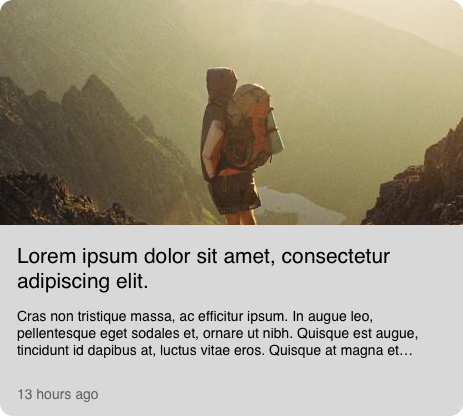
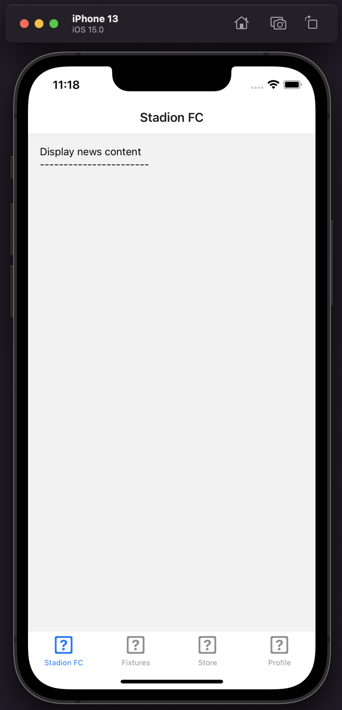

# Exercise - News Feed

After setting up the basic layout of the project, one of the Stadion developer's next priorities was to implement a list of news content on the home screen (the tab "Stadion FC").

However, after being promoted to Center Midfield in the Stadion FC team, the developer now needs you to finish that task.

**The dev has already completed the following:**

- Created a `HomeScreen.tsx` view and plugged it into the router.
- Implemented a `useEffect` in that screen that shows an example of how to get news feed content from the news api (using an api client). This example indicates how one can use paging to get only certain subsets of news data back at a time.

**Your brief from the client:**

- This screen needs to display the news article content from the API.
- Because the api contains thousands of articles, paging must be used to ensure we create a performant experience.
- The client has requested infinite scrolling (i.e as the user scrolls towards the end of the screen, more article content is dynamically loaded).
- It's up to you to determine the appropriate number of items to return each time 

## Task List

- [ ] **Setup state management** for the content loaded from the API
  - You have two options:
    - **Option 1 -** Create a reducer, thunks and actions for the news content using the existing redux setup:
      - you could follow the fixtures example in the fixtures module folder
      - also look at `root-actions.ts` and `root-reducer.ts` in the store folder.
    - **Option 2 -** Choose to take a different approach for state management in this screen.
    - Either approach is equally welcomed.
- [ ] **Display a simple loading indicator** when the first paged of data is being loaded
  - We have added a mocked 500ms timeout to simulate network latency.
  - Despite the fact this will not show the loader for very long, it's still important for it to be present in case network latency increases in production.
  - For infinite scrolling, you do not need to include any loading indicators for new pages of content being loaded.
- [ ] **Display news items as an infinite scrolled list of "article cards"**
  - Use an appropriate list component that comes with React Native for presenting large amounts of data
  - We've included a wireframe image of what the card can look like below in this readme. Use this as a guide, but you don't have to make it look exactly the same if you don't want to.
    - The library [styled-components](https://styled-components.com) has already been installed into the application.
    - We'd like to see this used, however if you aren't familiar with it, using stylesheets is also acceptable.
  - All of the data that comes back from the api is mocked and autogenerated.
    - For titles, **keep the length to two lines**, and truncate it with an ellipsis if required.
    - For descriptions, **keep the length to three lines**, and truncate it with an ellipsis if required.
  - Data will be returned latest first:
    - For items less than a day old, display the date on the card in **"x hours ago" format**.
    - For items less than a month old display the date on the card in **"x days ago" format**.
    - For items older than a month, display the date on the card in **"day Month Year"** format (i.e 3 September 2021)
  - We've console logged out the data in the screen so that you can see what it looks like, but you can also reference the `NewsArticle` Typescript interface as well.
- [ ] Run `yarn tsc` to check for and fix any typing issues.
- [ ] Run `yarn lint` to check for and fix any linting issues.

## Bonus Task

Only do this task if you have finished the above in a reasonable amount of time and feel adventurous. It's not mandatory to complete this.

- [ ] **Pull to refresh**
- When the user pulls to refresh, paging is reset, and the first page of content is displayed again.
- This will give the user the ability to pull to refresh to get the latest content from the API in production.
- The app then restarts infinite scroll paging

## News Article card design

This is the design for the news articles cards. Follow it from a structural perspective, but you're also welcome to get creative with it if you wish to (though this is not mandatory).

